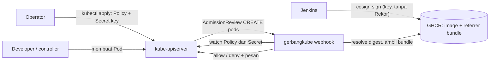
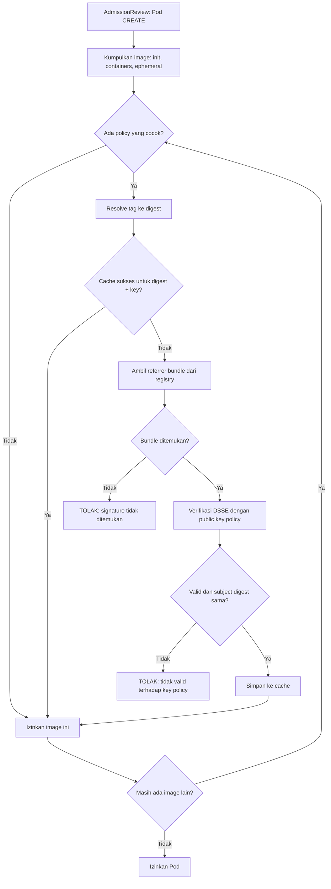

# PRD: gerbangkube

**Admission controller untuk verifikasi signature image container (cosign v3) pada Kubernetes k3s**

| Atribut | Nilai |
|---|---|
| Versi dokumen | 1 (draft) |
| Tanggal | 3 Oktober 2026 |
| Status | Draft, siap dijadikan spesifikasi implementasi |
| Nama kode | gerbangkube |
| Konteks | Eksperimen untuk skripsi |

**Label status klaim** yang dipakai di seluruh dokumen:

- **[TERBUKTI]**: sudah diuji langsung pada lingkungan nyata (lihat Lampiran A).
- **[ASUMSI]**: dipegang sebagai dasar desain, belum diuji.
- **[BELUM DIVERIFIKASI]**: perlu dicek pada source atau eksperimen sebelum diandalkan.

---

## 1. Ringkasan eksekutif

gerbangkube adalah admission controller Kubernetes yang melakukan satu hal: **menolak pembuatan Pod
jika image-nya tidak memiliki signature cosign yang valid**, untuk image yang tercakup oleh
policy. Operator mengaturnya secara deklaratif, mirip Kyverno: cukup menerapkan resource
`ImageSignaturePolicy` dan sebuah Secret berisi public key, tanpa mengubah konfigurasi
gerbangkube atau me-restart-nya.

Fokus teknis yang paling kritis adalah **kompatibilitas dengan cosign v3**. Cosign v3
menyimpan signature sebagai *Sigstore bundle* yang berupa OCI referrer, bukan lagi tag `.sig`
seperti pada v2. Verifikasi gerbangkube harus membaca format ini. Proses signing dilakukan oleh
Jenkins (di luar scope), memakai key pair cosign tanpa Rekor, dengan registry GHCR.

## 2. Latar belakang dan pernyataan masalah

1. **Signature tidak berguna tanpa enforcement.** Menandatangani image di pipeline hanya
   bermakna jika cluster menolak image yang tidak bertanda tangan. Kubernetes tidak
   memverifikasi signature image secara bawaan, sehingga dibutuhkan admission control.
2. **Alat yang ada bersifat umum.** Kyverno, sigstore policy-controller, Connaisseur, dan
   Ratify mampu melakukan verifikasi, tetapi mencakup lingkup yang jauh lebih luas dari
   kebutuhan. Proyek ini membangun versi minimal yang terfokus pada satu fungsi, sebagai
   eksperimen skripsi.
3. **Format signature berubah di cosign v3.** Kode atau alat yang berasumsi tag `.sig`
   (format v2) tidak dapat membaca signature yang dihasilkan v3 dengan konfigurasi default.
   gerbangkube harus dirancang untuk format baru sejak awal.
4. **Kondisi nyata pipeline.** Image berada di GHCR (campuran public dan private), signing
   dilakukan Jenkins dengan key pair tanpa transparency log, dan cluster berupa k3s.

## 3. Tujuan, non-tujuan, dan indikator keberhasilan

### 3.1 Tujuan

| ID | Tujuan |
|---|---|
| G1 | Menolak Pod yang memuat image tercakup policy tetapi tidak memiliki signature valid. |
| G2 | Membaca dan memverifikasi signature **cosign v3 (bundle v0.3, OCI referrer)** hasil signing key-based tanpa tlog. |
| G3 | Menyediakan pengalaman deklaratif seperti Kyverno: policy dan key diterapkan dengan `kubectl apply`, berlaku tanpa restart. |
| G4 | Mendukung image public dan private di GHCR. |
| G5 | Memberi pesan penolakan yang membedakan penyebab (tidak ada signature, key tidak cocok, masalah registry, key tidak dapat dimuat). |
| G6 | Menghasilkan keluaran yang dapat diuji dan dievaluasi secara sistematis untuk skripsi. |

### 3.2 Non-tujuan

| ID | Bukan tujuan |
|---|---|
| NG1 | Menjadi policy engine umum (tidak ada validasi/mutasi/generate resource lain). |
| NG2 | Mode Audit atau mode peringatan. gerbangkube selalu menolak pelanggaran. |
| NG3 | Memverifikasi ulang Pod yang sudah berjalan. gerbangkube hanya bekerja saat Pod dibuat. |
| NG4 | Mode keyless (OIDC/Fulcio), verifikasi transparency log (Rekor), atau timestamp (TSA). |
| NG5 | Proses signing. Dilakukan Jenkins dan di luar scope. |
| NG6 | Optimasi untuk skala besar atau pod churn tinggi. |
| NG7 | Verifikasi attestation (SBOM, provenance) selain signature dasar. |

### 3.3 Indikator keberhasilan

| ID | Indikator | Target |
|---|---|---|
| M1 | Lima skenario uji inti (S1 sampai S5, bagian 16) menghasilkan keputusan sesuai harapan | 5 dari 5 |
| M2 | Keputusan gerbangkube sama dengan `cosign verify` (oracle) pada seluruh image sampel | 100% sampel |
| M3 | Pesan penolakan untuk "tanpa signature" dan "key tidak cocok" dapat dibedakan | Ya |
| M4 | Perubahan policy atau Secret berlaku tanpa restart pod gerbangkube | Ya (waktu propagasi diukur dan dilaporkan) |
| M5 | Pod yang sudah berjalan (Grafana, Jenkins, dll.) tidak terpengaruh | Terbukti pada uji T10 |
| M6 | Seluruh komponen dapat dipasang di k3s dari manifest yang disediakan | Ya |

## 4. Pengguna dan skenario penggunaan

### 4.1 Aktor

| Aktor | Peran |
|---|---|
| Operator cluster | Memasang gerbangkube, menulis policy, mengelola Secret public key dan credential registry. |
| Pipeline CI (Jenkins) | Membangun dan menandatangani image; aktor sistem, tidak berinteraksi langsung dengan gerbangkube. |
| Developer aplikasi | Men-deploy workload; menerima penolakan dan pesannya bila image tidak bertanda tangan. |
| Peneliti/penguji | Menjalankan skenario uji dan mengumpulkan bukti untuk skripsi. |

### 4.2 Cerita pengguna

| ID | Sebagai | Saya ingin | Agar |
|---|---|---|---|
| US-1 | Operator | menerapkan satu policy yang mewajibkan signature untuk `ghcr.io/<org>/*` | semua workload dari org saya terlindungi |
| US-2 | Operator | menyimpan public key di Secret dan mengganti isinya | rotasi key tidak memerlukan restart atau build ulang |
| US-3 | Operator | image di luar policy (Grafana, Jenkins, dll.) tetap berjalan normal | tool pihak ketiga tidak terblokir |
| US-4 | Developer | mendapat pesan yang jelas saat deploy ditolak | tahu apakah masalahnya signature hilang, key salah, atau akses registry |
| US-5 | Operator | memakai image private di GHCR | verifikasi tidak gagal hanya karena visibilitas package |
| US-6 | Peneliti | membandingkan keputusan gerbangkube dengan `cosign verify` | dapat membuktikan kebenaran implementasi |
| US-7 | Operator | melihat log keputusan (image, digest, policy, hasil, alasan) | dapat mengaudit dan men-debug |
| US-8 | Operator | cluster tetap dapat dikelola saat gerbangkube bermasalah | komponen sistem tidak ikut terkunci |

## 5. Lingkup

**Dalam lingkup:**

- Admission webhook validasi untuk `pods` (operasi CREATE).
- CRD `ImageSignaturePolicy` dan controller pembaca policy serta Secret.
- Verifikasi signature cosign v3 (bundle v0.3 sebagai OCI referrer) dengan public key.
- Akses registry GHCR anonim dan terautentikasi.
- Manifest deploy (CRD, RBAC, sertifikat, Deployment, Service, PDB, webhook configuration).
- Rencana pengujian dan dokumentasi bukti.

**Di luar lingkup:** lihat non-tujuan (NG1 sampai NG7). Selain itu, hal berikut tidak
dicakup pada versi 0.1 dan dicatat sebagai keterbatasan atau pertanyaan terbuka
(bagian 19 dan 20): kontrol atas Ephemeral Container (`kubectl debug`), pencegahan
*tag repointing* setelah verifikasi, dan verifikasi pada resource selain Pod.

## 6. Asumsi, batasan, dan ketergantungan

| ID | Butir | Status |
|---|---|---|
| A1 | Cluster k3s (containerd). Image gerbangkube dimuat via `k3s ctr images import` atau registry. | [ASUMSI] |
| A2 | Registry GHCR dengan TLS valid; tidak ada CA internal. | [ASUMSI] |
| A3 | Signing memakai key pair cosign (public key tersedia untuk gerbangkube; private key tidak pernah masuk cluster). | [TERBUKTI] |
| A4 | Signing tanpa Rekor, memakai signing config `--no-default-rekor`; bundle tidak berisi tlog, TSA, maupun sertifikat. | [TERBUKTI] |
| A5 | Jenkins memakai cosign v3; versi persisnya belum dicatat (lokal pengujian: v3.0.6). | [BELUM DIVERIFIKASI] |
| A6 | `$IMAGE_REF` di Jenkins berupa digest atau tag belum diketahui (tag `7` mengisyaratkan tag). | [BELUM DIVERIFIKASI] |
| A7 | Key pair berjenis default cosign (ECDSA P-256). | [ASUMSI] |
| A8 | cert-manager tersedia untuk sertifikat TLS webhook. | [ASUMSI] |
| A9 | `registries.yaml` k3s hanya dibaca containerd; gerbangkube memerlukan credential sendiri. | [ASUMSI] |
| A10 | Workload private tetap memerlukan `imagePullSecrets` agar kubelet dapat menarik image. | [ASUMSI] |

**Ketergantungan:** cert-manager, library cosign v3 (`github.com/sigstore/cosign/v3`),
go-containerregistry, client-go atau controller-runtime, akses jaringan keluar dari pod
gerbangkube ke `ghcr.io`.

## 7. Arsitektur

### 7.1 Komponen

| Komponen | Tanggung jawab |
|---|---|
| Webhook server (HTTPS) | Menerima `AdmissionReview`, memanggil logika keputusan, membalas allow atau deny. |
| Policy controller | Me-watch `ImageSignaturePolicy` dan Secret terkait; menjaga snapshot policy+key di memori. |
| Matcher | Mencocokkan image dengan `imageReferences` pada tiap policy. |
| Verifier | Resolve digest, mengambil referrer bundle, memverifikasi signature dengan public key. |
| Cache | Menyimpan hasil verifikasi **sukses** per digest dengan TTL. |
| Logger | Mencatat setiap keputusan secara terstruktur (JSON). |

### 7.2 Diagram konteks



### 7.3 Alur keputusan



Aturan agregasi: Pod diizinkan **hanya jika setiap image-nya diizinkan**. Satu penolakan
menolak seluruh Pod, dan pesan menyebut image serta policy penyebabnya. Jika sebuah image
cocok dengan beberapa policy, **semua** policy tersebut harus lolos.

## 8. Spesifikasi verifikasi cosign v3

### 8.1 Format dan lokasi signature [TERBUKTI]

- Signature disimpan sebagai **OCI referrer** bertipe
  `application/vnd.dev.sigstore.bundle.v0.3+json`, dengan satu layer berisi bundle.
- Di GHCR, tampak tiga entri versi package: image (tag `7`), manifest referrer tanpa tag
  (`sha256:b2af65a4...`), dan **tag fallback referrers** `sha256-<hex-digest-image>`
  (`sha256-9820924b...`). Hex pada tag fallback sama dengan digest image.
- `cosign tree` menemukan artifact bertipe `https://sigstore.dev/cosign/sign/v1` lewat
  mekanisme OCI referrer.

### 8.2 Struktur bundle [TERBUKTI]

- `verificationMaterial` hanya berisi `publicKey.hint` (32 byte). **Tidak ada** `tlogEntries`,
  `timestampVerificationData`, ataupun sertifikat.
- `dsseEnvelope` dengan `payloadType: application/vnd.in-toto+json` dan satu signature.
- Payload: in-toto Statement v1 dengan `subject[0].digest.sha256` = digest image,
  `predicateType` = `https://sigstore.dev/cosign/sign/v1`, `predicate` = `{}`.
- Konsekuensi: signature mengikat **digest** saja, bukan nama repository atau tag.

### 8.3 Prosedur verifikasi yang disyaratkan

1. Resolve referensi image ke digest.
2. Temukan referrer bertipe bundle v0.3 untuk digest tersebut, termasuk melalui tag fallback
   bila registry tidak melayani Referrers API.
3. Ambil layer bundle dan parse.
4. Verifikasi signature DSSE dengan public key milik policy.
5. Pastikan `subject` digest pada statement sama dengan digest hasil resolve.
6. Pastikan `predicateType` sesuai (`https://sigstore.dev/cosign/sign/v1`).
7. Persyaratan tlog dan timestamp **dinonaktifkan secara eksplisit**; tidak memerlukan
   trusted root, TUF, atau akses ke layanan Sigstore.

`hint` pada bundle tidak terautentikasi dan **tidak boleh** dipakai untuk keputusan trust;
hanya boleh memperkaya pesan diagnostik.

### 8.4 `cosign verify` sebagai oracle [TERBUKTI]

| Perintah | Hasil |
|---|---|
| `cosign verify --key cosign.pub <image>` | Gagal: `failed to verify log inclusion ... 0 < 1` (tlog wajib secara default) |
| `... --insecure-ignore-tlog` pada image bertanda tangan | Lolos |
| `... --insecure-ignore-tlog` pada image tanpa signature | `no signatures found` |
| `... --insecure-ignore-tlog` dengan key yang salah | `... accepted signatures do not match threshold, Found: 0, Expected 1` |

Teks "Existence of the claims in the transparency log was verified offline" pada keluaran
CLI adalah teks bawaan dan tidak bermakna saat tlog diabaikan.

### 8.5 Hal yang belum diverifikasi [BELUM DIVERIFIKASI]

- Fungsi dan signature API Go cosign v3 untuk verifikasi bundle. Ada `VerifyNewBundle` di
  `pkg/cosign`, tetapi cara memakainya untuk key-based, cara mengambil bundle dari
  referrers, dan penyusunan `CheckOpts` harus dipastikan dari **source versi yang dipin**
  (rujukan: `cmd/cosign/cli/verify/verify.go` dan `pkg/cosign/verify.go`). Alternatif:
  sigstore-go langsung. Keputusan dibuat setelah membaca source.
- Ketersediaan tipe error spesifik pada library untuk klasifikasi kegagalan.
- Apakah `hint` = SHA-256 dari public key DER (cek dengan
  `openssl pkey -pubin -in cosign.pub -outform DER | openssl dgst -sha256 -binary | base64`;
  nilai yang diharapkan `FLZLU/y5KTEjySdq6wbIcna8iQ1NFKXR63euOaQLVYE=`).
- Perbaikan advisory **GHSA-fx35-mq7g-6g98** (bypass verifikasi lewat public key pada
  legacy bundle) pada versi library yang dipin; versi lokal v3.0.6 perlu dicek terhadap
  release notes, dan versi v3.1.x lebih baru perlu dipertimbangkan.

## 9. Persyaratan fungsional

Prioritas memakai MoSCoW: **M** (Must), **S** (Should), **C** (Could).

| ID | P | Persyaratan | Kriteria penerimaan |
|---|---|---|---|
| FR-01 | M | Webhook validasi menerima `AdmissionReview` v1 untuk `pods`, operasi **CREATE saja**. | Pod baru memicu panggilan; Pod yang sudah ada tidak diperiksa ulang; respons memuat `uid` yang sama dengan request. |
| FR-02 | M | Mengekstrak semua image dari `initContainers`, `containers`, dan `ephemeralContainers` pada spec Pod. | Pod dengan init container tak bertanda tangan ditolak (uji T1). |
| FR-03 | M | Mencocokkan tiap image dengan `spec.imageReferences` semua policy. Pola mendukung wildcard `*` yang cocok dengan karakter apa pun termasuk `/`. Pencocokan atas referensi ternormalisasi (detail dikonfirmasi saat implementasi). | Image yang tidak cocok dengan policy mana pun diizinkan tanpa verifikasi (S4). |
| FR-04 | M | Jika image cocok dengan beberapa policy, **semua** policy harus lolos. | Uji T3: satu policy dengan key salah menyebabkan penolakan. |
| FR-05 | M | Me-resolve referensi image ke digest sebelum verifikasi. | Log mencatat digest yang diverifikasi. |
| FR-06 | M | Memverifikasi signature **cosign v3 bundle** dengan public key policy sesuai bagian 8.3. | Hasil identik dengan `cosign verify --insecure-ignore-tlog` pada seluruh sampel (T11). |
| FR-07 | M | Mendefinisikan CRD `ImageSignaturePolicy` (cluster-scoped) dengan validasi skema (bagian 11). | Policy tidak valid ditolak API server. |
| FR-08 | M | Memuat public key dari Secret yang dirujuk `publicKeySecretRef` (namespace `gerbangkube-system`). | Policy dengan Secret valid berfungsi (S1). |
| FR-09 | M | Me-watch policy dan Secret; perubahan berlaku **tanpa restart**. | Uji T4 dan T5. |
| FR-10 | M | Mengakses GHCR secara anonim untuk image public dan dengan credential untuk image private. | S1 (public) dan S5 (private dengan/tanpa credential). |
| FR-11 | M | Memberi pesan penolakan yang membedakan penyebab sesuai bagian 13. | S2 dan S3 menghasilkan pesan berbeda. |
| FR-12 | M | **Fail closed**: kegagalan memuat key, timeout, atau error tak terduga pada image yang tercakup policy berujung penolakan. | Uji T6. |
| FR-13 | S | Cache hasil verifikasi sukses per kombinasi (digest, policy/key) dengan TTL; hasil gagal tidak di-cache. | Uji T12: verifikasi kedua tidak memanggil registry; image yang baru ditandatangani tidak tertahan oleh cache negatif. |
| FR-14 | S | Mencatat setiap keputusan secara terstruktur: namespace, nama pod, image, digest, policy, hasil, alasan. | Log JSON memuat kolom tersebut. |
| FR-15 | S | Endpoint kesehatan `/healthz` untuk probe. | Probe readiness dan liveness (HTTPS) lolos. |
| FR-16 | S | Sertifikat TLS dibaca ulang dari disk agar rotasi cert-manager otomatis terbawa. | Rotasi tidak memerlukan restart. |
| FR-17 | C | Opsi `spec.requireDigest` pada policy untuk mewajibkan image berbentuk `@sha256:`. | Belum diputuskan (Q4). |
| FR-18 | C | Subresource `status` pada policy (kondisi: key termuat, siap). | Belum diputuskan. |
| FR-19 | C | Kontrol atas Ephemeral Container melalui rule `pods/ephemeralcontainers`. | Belum diputuskan (Q3). |

## 10. Persyaratan non-fungsional

| ID | Kategori | Persyaratan |
|---|---|---|
| NFR-01 | Keamanan | Hanya public key yang disimpan di cluster. Private key (`cosign.key`) tidak pernah masuk cluster. |
| NFR-02 | Keamanan | RBAC minimal: `ClusterRole` hanya untuk get/list/watch `ImageSignaturePolicy` (resource cluster-scoped); `Role` di `gerbangkube-system` hanya untuk get/list/watch Secret. |
| NFR-03 | Keamanan | Pod gerbangkube berjalan non-root, root filesystem read-only, tanpa privilege escalation, semua capability di-drop. |
| NFR-04 | Keamanan | Credential registry gerbangkube memakai token dengan hak minimum (scope `read:packages`) dan disimpan sebagai Secret. |
| NFR-05 | Keamanan | Versi library cosign yang dipin memuat perbaikan advisory GHSA-fx35-mq7g-6g98 dan dicatat di `go.mod`. |
| NFR-06 | Keandalan | `failurePolicy: Fail`, minimal 2 replika, PodDisruptionBudget (`minAvailable: 1`). |
| NFR-07 | Keandalan | gerbangkube dan komponen sistem dikecualikan dari webhook (`namespaceSelector`) untuk mencegah deadlock: `kube-system`, `gerbangkube-system`, `cert-manager`. |
| NFR-08 | Keandalan | Batas waktu verifikasi internal (10 detik) lebih kecil dari `timeoutSeconds` webhook (15 detik); batas maksimum Kubernetes adalah 30 detik. |
| NFR-09 | Performa | Tidak ada target latensi ketat (NG6). Latensi pada cache miss dan cache hit diukur dan dilaporkan untuk skripsi. |
| NFR-10 | Observability | Log terstruktur JSON ke stdout. Metrics Prometheus bersifat opsional (di luar versi 0.1). |
| NFR-11 | Portabilitas | Berjalan di k3s dengan manifest standar Kubernetes; tidak bergantung pada fitur khusus k3s. |
| NFR-12 | Maintainability | Verifier dipisahkan di balik interface agar logika keputusan dapat diuji dengan verifier tiruan. |
| NFR-13 | Reproduksibilitas | Seluruh langkah pengujian dapat diulang dari dokumen dan skrip, dengan versi cosign dan library yang dicatat. |

## 11. Spesifikasi CRD `ImageSignaturePolicy`

Nama grup `gerbangkube.example.io` bersifat sementara dan perlu diganti sebelum rilis.

```yaml
apiVersion: gerbangkube.example.io/v1alpha1
kind: ImageSignaturePolicy
metadata:
  name: require-signed-images        # cluster-scoped
spec:
  imageReferences:
    - "ghcr.io/<org>/*"
  publicKeySecretRef:
    name: cosign-public-key          # Secret di namespace gerbangkube-system
    key: cosign.pub                  # kunci di dalam Secret (PEM public key)
```

| Field | Tipe | Wajib | Keterangan |
|---|---|---|---|
| `spec.imageReferences` | daftar string | Ya (minimal 1) | Pola referensi image. `*` cocok dengan karakter apa pun termasuk `/`. |
| `spec.publicKeySecretRef.name` | string | Ya | Nama Secret di namespace `gerbangkube-system`. |
| `spec.publicKeySecretRef.key` | string | Ya | Nama kunci pada `data` Secret yang berisi PEM public key. |

Aturan semantik:

- Satu policy mewakili satu public key. Banyak key atau rotasi key dicapai dengan banyak
  policy atau dengan memperbarui isi Secret.
- Policy bersifat cluster-scoped; Secret key selalu berada di `gerbangkube-system`.
- Image yang tidak cocok dengan policy mana pun diizinkan.
- Tidak ada field `mode`. gerbangkube selalu menolak (NG2).
- Secret yang tidak ada, atau key di dalamnya tidak dapat di-parse, menyebabkan penolakan
  untuk image yang cocok dengan policy tersebut (fail closed).

Contoh Secret:

```yaml
apiVersion: v1
kind: Secret
metadata:
  name: cosign-public-key
  namespace: gerbangkube-system
stringData:
  cosign.pub: |
    -----BEGIN PUBLIC KEY-----
    ...
    -----END PUBLIC KEY-----
```

## 12. Alur interaksi dengan Kubernetes

| Aspek | Keputusan |
|---|---|
| Jenis webhook | `ValidatingWebhookConfiguration`, tanpa mutating webhook. |
| Rule | `apiGroups: [""]`, `apiVersions: ["v1"]`, `operations: ["CREATE"]`, `resources: ["pods"]`. |
| `matchPolicy` | `Equivalent`. |
| `sideEffects` | `None`. |
| `admissionReviewVersions` | `["v1"]`. |
| `failurePolicy` | `Fail`. |
| `timeoutSeconds` | 15. |
| `namespaceSelector` | `kubernetes.io/metadata.name NotIn [kube-system, gerbangkube-system, cert-manager]`. |
| `clientConfig` | Service `gerbangkube` di `gerbangkube-system`, path `/validate`, port 443; CA diinjeksi cert-manager lewat anotasi `cert-manager.io/inject-ca-from`. |
| Cakupan workload | Hanya Pod. Deployment, StatefulSet, DaemonSet, Job, dan CronJob tercakup lewat Pod yang mereka buat. |

Konsekuensi cakupan Pod: `kubectl apply` pada Deployment tetap berhasil, sedangkan
penolakan muncul sebagai kegagalan pembuatan Pod pada ReplicaSet (terlihat di event
ReplicaSet dengan pesan dari gerbangkube). Ini diterima untuk versi 0.1 (lihat pengujian T9).

## 13. Pemetaan kegagalan ke pesan penolakan

Dasar pemetaan adalah hasil uji kasus negatif [TERBUKTI]: tanpa signature menghasilkan
`no signatures found`; key salah menghasilkan `accepted signatures do not match threshold,
Found: 0, Expected 1` yang dibungkus pesan generik `no matching attestations`.

| Penyebab | Pesan penolakan (usulan) |
|---|---|
| Referrer bundle tidak ditemukan | `image <ref> ditolak: signature tidak ditemukan (policy <nama>)` |
| Signature ada tetapi tidak lolos dengan key policy | `image <ref> ditolak: signature tidak valid terhadap public key policy <nama> (key berbeda atau signature rusak)` |
| Gagal mengakses registry atau credential | `image <ref> ditolak: gagal mengakses registry (<alasan>)` |
| Secret atau public key policy tidak dapat dimuat | `image <ref> ditolak: public key policy <nama> tidak dapat dimuat` |
| Timeout verifikasi | `image <ref> ditolak: verifikasi melewati batas waktu` |

Catatan:

- Pada jalur bundle, "key salah" dan "signature rusak atau dimodifikasi" menghasilkan error
  yang sama. Karena itu pesan kedua kasus digabung. `hint` dapat dipakai untuk memperjelas
  secara diagnostik, bukan untuk keputusan.
- Klasifikasi di Go sebaiknya memakai **tipe error** dari library bila tersedia;
  pencocokan string hanya sebagai cadangan (teks error dapat berubah antar versi).

## 14. Deployment dan operasi

### 14.1 Artefak

| Berkas | Isi |
|---|---|
| `deploy/00-namespace.yaml` | Namespace `gerbangkube-system`. |
| `deploy/05-crd.yaml` | CRD `ImageSignaturePolicy` (baru). |
| `deploy/06-rbac.yaml` | ServiceAccount, ClusterRole+Binding (policy), Role+Binding (Secret) (baru). |
| `deploy/10-certificate.yaml` | Issuer self-signed dan Certificate untuk TLS webhook. |
| `deploy/30-deployment.yaml` | Deployment (2 replika), Service, PDB. |
| `deploy/40-webhook.yaml` | `ValidatingWebhookConfiguration` (CREATE saja). |
| Contoh `policy.yaml` dan `secret.yaml` | Policy dan Secret public key untuk uji. |

Berkas `deploy/20-pubkey.yaml` (ConfigMap) dari kerangka lama **digantikan** oleh Secret
dan CRD.

### 14.2 Urutan pemasangan

1. cert-manager terpasang.
2. Namespace, CRD, RBAC, Certificate.
3. Secret public key dan (bila perlu) Secret credential registry.
4. Deployment, Service, PDB; tunggu rollout selesai.
5. `ImageSignaturePolicy`.
6. **`ValidatingWebhookConfiguration` terakhir**, agar cluster tidak menolak pod gerbangkube
   sebelum siap.

### 14.3 Credential registry (GHCR)

- Image public: akses anonim bekerja otomatis.
- Image private: Secret berisi `config.json` (format docker config) untuk `ghcr.io`
  (username GitHub dan PAT dengan scope `read:packages`), di-mount dan diarahkan lewat
  variabel `DOCKER_CONFIG`. Jenis token yang didukung GHCR perlu dikonfirmasi.
- Credential gerbangkube **terpisah** dari `imagePullSecrets` workload.
- Signature (referrer dan tag fallback) berada di package yang sama dengan image, sehingga
  visibilitas dan credential mengikuti image.

### 14.4 Catatan k3s

- Image gerbangkube dimuat dengan `docker save ... | sudo k3s ctr images import -`, atau lewat
  registry (wajib bila node lebih dari satu).
- `/etc/rancher/k3s/registries.yaml` tidak berlaku untuk gerbangkube.
- Jika webhook timeout padahal pod sehat, periksa firewall (ufw/firewalld) terhadap CIDR
  pod `10.42.0.0/16` dan service `10.43.0.0/16`.
- Pada reboot, selama gerbangkube belum siap, Pod baru di namespace tercakup ditolak karena
  `failurePolicy: Fail`. Pod yang sudah ada tidak terpengaruh.

### 14.5 Prosedur pemulihan darurat

Jika gerbangkube mengunci cluster: hapus `ValidatingWebhookConfiguration` bernama `gerbangkube`
(`kubectl delete validatingwebhookconfiguration gerbangkube`), perbaiki masalah, lalu pasang
kembali. Prosedur ini harus dicoba dan didokumentasikan sebelum pengujian (R4).

## 15. Keamanan dan model ancaman

| ID | Ancaman | Mitigasi / status |
|---|---|---|
| TH-1 | Image tanpa signature atau dengan signature key lain dijalankan | Dicegah oleh FR-06 (untuk image yang tercakup policy). |
| TH-2 | **Image di luar `imageReferences` tidak diperiksa** (by design) | Keterbatasan yang disengaja (US-3); cakupan policy menentukan perlindungan. |
| TH-3 | **Tag repointing (TOCTOU)**: tag diubah setelah verifikasi sehingga kubelet menarik image berbeda | Keterbatasan versi 0.1. Mitigasi opsional: `requireDigest` (FR-17) atau mutating webhook yang mengganti tag dengan digest (di luar lingkup). Log mencatat digest yang diverifikasi. |
| TH-4 | Pihak yang dapat mengubah Secret public key atau policy melemahkan perlindungan | RBAC ketat pada `ImageSignaturePolicy` dan Secret di `gerbangkube-system`; ini adalah root of trust cluster. |
| TH-5 | Workload di namespace yang dikecualikan (`kube-system`, dll.) lolos tanpa pemeriksaan | Keterbatasan yang disengaja demi mencegah deadlock; batasi siapa yang boleh membuat Pod di namespace tersebut. |
| TH-6 | Ephemeral Container (`kubectl debug`) memasukkan image tak bertanda tangan ke Pod berjalan | Tidak tercakup pada CREATE `pods`; opsi FR-19 (Q3). |
| TH-7 | Bypass verifikasi lewat kelemahan library cosign | Pin versi yang memuat perbaikan GHSA-fx35-mq7g-6g98 (NFR-05). |
| TH-8 | Kebocoran PAT GHCR pada gerbangkube | Scope minimum `read:packages`, Secret, rotasi berkala. |
| TH-9 | Penghapusan versi package GHCR yang untagged menghapus manifest signature | Jangan menjalankan pembersihan otomatis versi untagged tanpa memastikan itu bukan referrer (R6). |
| TH-10 | gerbangkube mati lalu cluster terkunci (atau sebaliknya, fail-open bila `Ignore`) | `Fail` + replika + PDB + prosedur pemulihan (14.5). |
| TH-11 | Private key signing bocor | Di luar scope gerbangkube (dikelola di Jenkins); dicatat sebagai ketergantungan kepercayaan. |

## 16. Rencana pengujian

### 16.1 Skenario inti (wajib; bahan bab pengujian skripsi)

| ID | Skenario | Hasil yang diharapkan |
|---|---|---|
| S1 | Image signed dengan key yang benar | Diizinkan |
| S2 | Image **tanpa** signature | Ditolak, pesan "signature tidak ditemukan" |
| S3 | Image signed dengan key **lain** | Ditolak, pesan "tidak valid terhadap public key policy" |
| S4 | Image di luar `imageReferences` (misalnya Grafana) | Diizinkan tanpa diperiksa |
| S5 | Image private di GHCR tanpa credential gerbangkube | Ditolak, pesan "gagal mengakses registry" (bukan masalah signature); dengan credential benar dan signature valid: diizinkan |

### 16.2 Skenario tambahan

| ID | Skenario | Hasil yang diharapkan |
|---|---|---|
| T1 | Init container tak bertanda tangan, container utama signed | Ditolak |
| T2 | Pod multi-container, satu image tak bertanda tangan | Seluruh Pod ditolak; pesan menyebut image penyebab |
| T3 | Dua policy cocok, satu memakai key salah | Ditolak |
| T4 | Isi Secret public key diganti (rotasi) | Perilaku baru berlaku tanpa restart; waktu propagasi diukur |
| T5 | Policy diubah atau dihapus | Efek berlaku tanpa restart |
| T6 | Secret public key tidak ada atau tidak valid | Ditolak (fail closed), pesan "tidak dapat dimuat" |
| T7 | gerbangkube dimatikan (scale 0) | Pod baru di namespace tercakup ditolak; Pod di `kube-system` tetap dapat dibuat |
| T8 | Tag dipindahkan ke image lain yang tak bertanda tangan | Ditolak (verifikasi atas digest baru) |
| T9 | `kubectl apply` Deployment dengan image tak bertanda tangan | Apply sukses; ReplicaSet gagal membuat Pod, event memuat pesan gerbangkube |
| T10 | Pod lama yang sedang berjalan (Grafana, Jenkins, dll.) | Tidak terpengaruh |
| T11 | Konsistensi dengan `cosign verify --insecure-ignore-tlog` pada semua image sampel | Keputusan identik |
| T12 | Verifikasi kedua untuk digest yang sama; kegagalan lalu image ditandatangani | Kedua tidak mengakses registry (cache hit); kegagalan tidak di-cache |

### 16.3 Tingkat pengujian

- **Unit**: logika `decide`, pencocokan pola, klasifikasi error, cache TTL (dengan verifier tiruan).
- **Integrasi lokal**: verifier terhadap image uji di GHCR (image bertanda tangan `:7`, tanpa
  signature `:6`, dan key lain), dibandingkan dengan `cosign verify`.
- **End to end**: pada k3s dengan webhook terpasang; seluruh skenario S dan T.
- **Bukti**: simpan perintah, versi alat, keluaran, dan log gerbangkube untuk tiap skenario.

## 17. Evaluasi untuk skripsi

Bagian ini bersifat opsional dan **belum diputuskan** (Q5).

- Variabel yang dapat diukur: ketepatan keputusan (S dan T), latensi admission pada cache
  miss dan cache hit, penggunaan resource pod gerbangkube, serta kompleksitas konfigurasi
  (jumlah dan ukuran manifest policy).
- Pembanding yang mungkin: Kyverno `verifyImages`. Dukungan Kyverno terhadap bundle cosign
  v3 hasil signing key-based tanpa tlog **[BELUM DIVERIFIKASI]** dan harus dicek lebih dulu;
  hasil pengecekan itu sendiri dapat menjadi temuan.
- Batasan klaim: gerbangkube adalah eksperimen terfokus; perbandingan tidak boleh menyiratkan
  kesetaraan fitur dengan alat yang jauh lebih luas.

## 18. Rencana implementasi bertahap

| Tahap | Pekerjaan | Kriteria selesai |
|---|---|---|
| M0 | Pembuktian cosign v3 | Sebagian besar selesai (Lampiran A). Sisa: catat versi cosign Jenkins, cek `$IMAGE_REF`, cek `hint`. |
| M1 | Modul Go dengan cosign v3; baca source `verify.go` v3; program uji mandiri yang memverifikasi image `:7`, `:6`, dan key lain | Hasil sama dengan `cosign verify` (M2 indikator) |
| M2 | Verifier (bundle v3), klasifikasi error, cache, unit test | Pesan S2 dan S3 berbeda; unit test lulus |
| M3 | CRD, informer policy dan Secret, matcher | Reload tanpa restart (T4, T5) |
| M4 | Webhook handler, logika keputusan, log terstruktur | Uji lokal dengan AdmissionReview palsu lulus |
| M5 | Manifest (CRD, RBAC, sertifikat, deployment, webhook); build dan muat image ke k3s; deploy | gerbangkube berjalan, webhook aktif |
| M6 | Eksekusi pengujian S1 sampai S5 dan T1 sampai T12; dokumentasi bukti | Indikator M1 sampai M6 tercapai |
| M7 | (Opsional) evaluasi pembanding dan penulisan | Sesuai keputusan Q5 |

**Definition of Done (versi 0.1):** semua FR berprioritas Must terpenuhi; skenario S1 sampai
S5 lulus; manifest dapat dipasang dari nol di k3s; prosedur pemulihan (14.5) teruji;
versi cosign, library, dan alat tercatat.

## 19. Risiko dan mitigasi

| ID | Risiko | Dampak | Mitigasi |
|---|---|---|---|
| R1 | API Go cosign v3 tidak jelas atau berubah antar versi minor | Verifier tidak dapat dibangun atau rapuh | Pin versi; baca source; program uji mandiri lebih dulu (M1); alternatif sigstore-go |
| R2 | Perilaku referrers GHCR (fallback tag) tidak tertangani library | Signature tidak ditemukan | Uji langsung pada GHCR (M1); go-containerregistry diharapkan menangani fallback, tetapi dibuktikan |
| R3 | Versi cosign Jenkins berbeda dari library gerbangkube | Format bundle tidak cocok | Catat dan samakan versi; uji dengan image hasil Jenkins nyata |
| R4 | `failurePolicy: Fail` mengunci cluster | Pod baru tidak dapat dibuat | Pengecualian namespace, replika+PDB, prosedur 14.5 |
| R5 | Secret public key salah atau terhapus | Semua deploy tercakup ditolak | Fail closed disengaja; log dan pesan jelas; uji T6 |
| R6 | Pembersihan GHCR menghapus versi untagged | Signature hilang, image jadi ditolak | Tidak ada pembersihan otomatis versi untagged tanpa pengecualian referrer |
| R7 | Tag repointing setelah verifikasi (TOCTOU) | Image berbeda berjalan | Dokumentasikan sebagai keterbatasan; opsi `requireDigest`; log digest |
| R8 | Ephemeral Container tidak tercakup | Celah operasional | Dokumentasikan; opsi FR-19 |
| R9 | PAT GHCR bocor atau kedaluwarsa | Image private gagal diverifikasi, atau kebocoran akses | Scope minimum, rotasi, pesan error registry yang jelas |
| R10 | Perluasan lingkup (scope creep) | Proyek tidak selesai | Patuhi non-tujuan; fitur tambahan masuk kategori Could |
| R11 | Advisory keamanan cosign terkait verifikasi | Bypass | Pin versi yang diperbaiki; pantau release notes |

## 20. Pertanyaan terbuka

| ID | Pertanyaan | Dampak |
|---|---|---|
| Q1 | Versi cosign di Jenkins? | Kompatibilitas format bundle |
| Q2 | `$IMAGE_REF` di Jenkins berupa digest atau tag? | Ketepatan apa yang ditandatangani |
| Q3 | Apakah Ephemeral Container perlu dicakup (rule `pods/ephemeralcontainers`)? | Cakupan keamanan |
| Q4 | Apakah policy perlu opsi `requireDigest`? | Mitigasi TOCTOU |
| Q5 | Apakah hasil dibandingkan dengan Kyverno di skripsi? | Bab evaluasi |
| Q6 | Nama final proyek dan grup CRD? | Manifest dan kode |
| Q7 | client-go informer atau controller-runtime? | Kompleksitas implementasi |
| Q8 | `cosign.VerifyNewBundle` atau sigstore-go langsung? | Desain verifier |
| Q9 | Apakah image multi-arch (index) dipakai? Signature menempel pada digest yang di-resolve dari referensi yang sama, jadi konsisten, tetapi perlu dipastikan. | Pengujian |
| Q10 | Apakah ada kebijakan pembersihan versi package di GHCR? | Risiko R6 |

## Lampiran A. Bukti eksperimen

**A.1 Perintah signing di Jenkins**

```bash
unset COSIGN_SIGNING_CONFIG
unset COSIGN_USE_SIGNING_CONFIG

cosign login ghcr.io -u "$DOCKER_USER" -p "$DOCKER_PASS"

cosign signing-config create \
    --no-default-rekor \
    --out /tmp/signing-config-no-tlog.json

export COSIGN_PASSWORD="$COSIGN_PASSWORD"
cosign sign --key "$COSIGN_KEY" \
    --signing-config /tmp/signing-config-no-tlog.json \
    --new-bundle-format \
    --yes \
    "$IMAGE_REF"
```

Catatan di luar gerbangkube: `-p "$DOCKER_PASS"` menaruh password pada argumen proses; lebih aman
memakai `--password-stdin`.

**A.2 Struktur GHCR (package `user-service`)**

| Entri | Keterangan |
|---|---|
| tag `7` | image; digest `sha256:9820924b689734c43df3b7b35b5ad51433ce772373fab506da998ea28e4a9da2` |
| `sha256:b2af65a4ba816ce7d6c06585d88cbe3e11675f3095926acbaf6b509c26a80adf` (tanpa tag) | manifest referrer; `artifactType` bundle v0.3; `subject` = digest image; satu layer `sha256:fb8fbd25...` (667 byte) |
| tag `sha256-9820924b...` | tag fallback referrers (hex = digest image) |

**A.3 Hasil perintah (cosign v3.0.6, go1.25.7)**

| Perintah | Hasil |
|---|---|
| `cosign tree ghcr.io/rharff/user-service:7` | Menemukan artifact `sigstore.dev/cosign/sign/v1` via OCI referrer pada `b2af65...` |
| `cosign verify --key cosign.pub ... :7` | Gagal: `failed to verify log inclusion ... 0 < 1` |
| `cosign verify --key cosign.pub --insecure-ignore-tlog ... :7` | Lolos; digest terverifikasi `9820924b...` |
| `... --insecure-ignore-tlog ... :6` (tanpa signature) | `no signatures found` |
| `... --insecure-ignore-tlog ... :7` dengan key lain | `could not verify envelope: accepted signatures do not match threshold, Found: 0, Expected 1` |

**A.4 Isi bundle**

- `mediaType`: `application/vnd.dev.sigstore.bundle.v0.3+json`
- `verificationMaterial`: hanya `publicKey.hint` (32 byte)
- `dsseEnvelope.payloadType`: `application/vnd.in-toto+json`; satu signature
- Payload terdekode: in-toto Statement v1, `subject[0].digest.sha256` = `9820924b...`,
  `predicateType` = `https://sigstore.dev/cosign/sign/v1`, `predicate` = `{}`

## Lampiran B. Status kerangka kode lama

Folder `gerbangkube/` (dari percakapan sebelumnya) **belum pernah dikompilasi atau diuji**.

| Bagian | Status |
|---|---|
| Server TLS, handler AdmissionReview, ekstraksi image, cache TTL | Dapat dipakai ulang (perlu penyesuaian) |
| `verify.go` (cosign v2, tag `.sig`) | **Ditulis ulang** untuk cosign v3 bundle |
| Konfigurasi lewat flag CLI | **Diganti** CRD policy dan Secret |
| `deploy/20-pubkey.yaml` (ConfigMap) | **Diganti** Secret dan CRD |
| `deploy/40-webhook.yaml` | Perlu dibuang operasi `UPDATE` (CREATE saja) |
| `Dockerfile`, `10-certificate.yaml`, `30-deployment.yaml` | Dapat dipakai ulang; samakan versi Go dengan `go.mod` |

## Lampiran C. Glosarium

| Istilah | Arti |
|---|---|
| Admission controller / webhook | Komponen yang menyetujui atau menolak request ke API server Kubernetes sebelum disimpan. |
| Cosign | Alat untuk menandatangani dan memverifikasi artifact container. |
| Sigstore bundle | Format paket signature beserta materi verifikasinya (v0.3 pada pembahasan ini). |
| DSSE | Dead Simple Signing Envelope: amplop yang menandatangani payload beserta tipenya. |
| OCI referrer | Artifact yang menunjuk ke artifact lain lewat field `subject`; dipakai cosign v3 untuk menyimpan signature. |
| Tag fallback referrers | Tag `sha256-<hex>` berisi index referrer, dipakai bila registry tidak melayani Referrers API. |
| Rekor / tlog | Transparency log Sigstore; tidak dipakai di proyek ini. |
| TSA | Timestamp authority; tidak ada pada bundle di proyek ini. |
| TOCTOU | Time-of-check to time-of-use: celah antara saat verifikasi dan saat penggunaan. |
| Fail closed | Bila ragu atau gagal, keputusan default adalah menolak. |
| GHCR | GitHub Container Registry (`ghcr.io`). |
| CRD | Custom Resource Definition. |

## Lampiran D. Rujukan untuk diperiksa ulang sebelum dikutip

- Catatan rilis dan dokumentasi cosign v3 (repositori sigstore/cosign), termasuk perubahan
  format signature, flag signing, dan advisory GHSA-fx35-mq7g-6g98.
- Spesifikasi OCI Image dan Distribution v1.1 (referrers API dan skema tag fallback).
- Dokumentasi Kubernetes tentang dynamic admission control (validating webhook).
- Dokumentasi Kyverno `verifyImages` (bila perbandingan dilakukan).
- Dokumentasi go-containerregistry (penanganan referrers dan fallback).

Rujukan ini sengaja tidak disertai tautan agar tidak ada tautan yang belum diverifikasi;
tambahkan tautan dan tanggal akses setelah diperiksa langsung.
